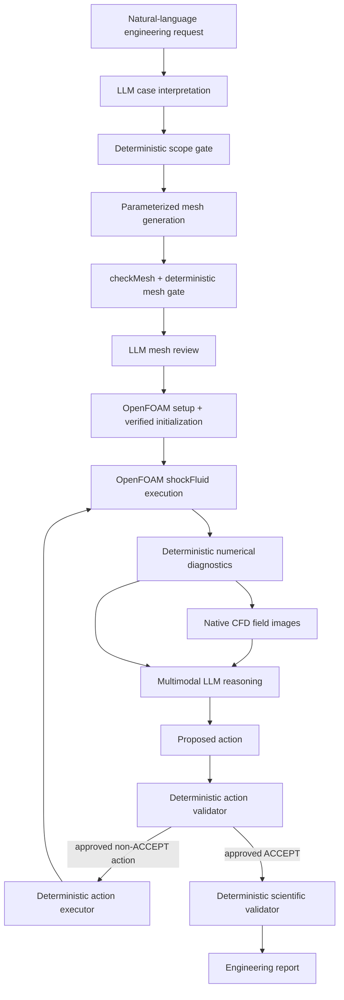

# Physics-Constrained Multimodal CFD Agent

A reproducible research prototype that couples an LLM with deterministic CFD tools for compressible internal nozzle flow.

The core design principle is simple:

> **LLM reasoning, deterministic scientific authority.**

The LLM interprets an engineering request, reviews mesh evidence, examines numerical CFD diagnostics and field images, diagnoses the current simulation state, and proposes the next action. Deterministic code decides whether that action is allowed and whether the CFD result is scientifically acceptable.

This repository is intentionally scoped. It is not a universal CFD agent. The demonstrated domain is axisymmetric, inviscid, compressible flow through a converging-diverging nozzle using OpenFOAM Foundation v14.

## What is demonstrated

Three cases use the same parameterized agent pipeline:

| Case | Change | Feedback behavior | Final deterministic result |
| --- | --- | --- | --- |
| A | Canonical geometry, p0 = 200 kPa | `CONTINUE_RUN -> ACCEPT` | `PASS_SINGLE_MESH` after 2 CFD iterations |
| B | Exit radius 35.4 mm -> 37.0 mm | `ACCEPT` | `PASS_SINGLE_MESH` after 1 CFD iteration |
| C | Reservoir total pressure 200 -> 220 kPa | `ACCEPT` | `PASS_SINGLE_MESH` after 1 CFD iteration |

Case A is deliberately started at 0.001 s in the feedback demonstration so that the first state is physically healthy but not yet stationary. The LLM identifies the incomplete convergence, proposes `CONTINUE_RUN`, the deterministic action gate approves it, and the existing OpenFOAM solution is continued to 0.006 s. The second reasoning step accepts only after the deterministic checks pass.

Cases B and C demonstrate that the same workflow can handle a nearby geometry change and a nearby operating-condition change without hand-editing the OpenFOAM case.

See [`docs/CASES.md`](docs/CASES.md) and [`demo/published_campaign/CAMPAIGN_SUMMARY.json`](demo/published_campaign/CAMPAIGN_SUMMARY.json).

## Agent architecture



The LLM can propose high-level actions such as:

- `ACCEPT`
- `CONTINUE_RUN`
- `REQUEST_DIAGNOSTIC`
- `REFINE_THROAT`
- `REFINE_GRADIENT_REGION`
- `RESTART_CLEAN`

The LLM does **not** directly edit OpenFOAM dictionaries, invent mesh counts, override conservation thresholds, or declare a failed CFD state acceptable.

See [`docs/architecture.md`](docs/architecture.md).

## Physics and numerical method

Current supported physics:

- internal axisymmetric converging-diverging nozzle
- calorically perfect air
- gamma = 1.4
- R = 287 J/(kg K)
- inviscid compressible Euler equations
- adiabatic slip walls
- reservoir total-pressure / total-temperature inlet
- pressure-free computational outlet
- structured axisymmetric wedge mesh
- OpenFOAM Foundation v14 `shockFluid`
- Kurganov fluxes
- Minmod reconstruction
- Euler time integration
- adjustable timestep with maxCo = 0.4 in the demonstrated cases

The nominal 30 kPa downstream pressure is **external-environment metadata** for regime interpretation. It is not imposed as a fixed static pressure at the computational outlet when the computed outlet is fully supersonic.

See [`docs/PHYSICS_SCOPE.md`](docs/PHYSICS_SCOPE.md), [`docs/NUMERICAL_METHOD.md`](docs/NUMERICAL_METHOD.md), and [`docs/REFERENCE_VALIDATION.md`](docs/REFERENCE_VALIDATION.md).

## Quick reproduction on Windows + WSL2

Validated development environment:

- Windows
- Python 3.13 on the host, Python 3.11+ expected
- WSL2 with Ubuntu 24.04
- OpenFOAM Foundation v14 at `/opt/openfoam14/etc/bashrc`
- Python 3 + NumPy available inside WSL
- a Gemini API key for the current LLM backend

Create a host virtual environment and install dependencies:

```powershell
py -3.13 -m venv .venv
.\.venv\Scripts\Activate.ps1
python -m pip install --upgrade pip
python -m pip install -r requirements.txt
```

Configure the LLM backend for the current PowerShell session:

```powershell
$env:GEMINI_API_KEY = "YOUR_API_KEY"
$env:GEMINI_MODEL = "gemini-3.5-flash-lite"
```

Check the environment:

```powershell
python .\scripts\check_environment.py
```

Run the complete demonstrated campaign:

```powershell
powershell -ExecutionPolicy Bypass -File .\scripts\run_repro_campaign.ps1
```

That command runs:

1. Case A with a deliberately short first CFD horizon to exercise the feedback loop.
2. Case B with the changed exit radius.
3. Case C with the changed reservoir pressure.
4. A sanitized combined campaign summary.

Runtime outputs are written under `demo/runs/` and are ignored by Git.

For Linux-host instructions and manual per-case commands, see [`docs/reproducibility.md`](docs/reproducibility.md).

## Try your own nearby nozzle request

The natural-language prompt is the real entry point. Start from:

[`examples/nozzle_e2e/PROMPT_TEMPLATE.txt`](examples/nozzle_e2e/PROMPT_TEMPLATE.txt)

and fill in geometry and operating conditions.

The deterministic scope gate currently enforces explicit software bounds on geometry, pressure, temperature, area ratio, pressure ratio, mesh scale, wedge angle, integration horizon, and Courant limit. Those bounds are **guardrails**, not a claim that every point inside them has been experimentally validated.

The demonstrated transfer evidence is local:

- exit radius: 35.4 mm -> 37.0 mm
- reservoir total pressure: 200 kPa -> 220 kPa

See [`docs/PARAMETER_GUIDE.md`](docs/PARAMETER_GUIDE.md) before trying a new case.

Example custom **closed-loop** prompt:

```powershell
python .\scripts\run_nozzle_feedback.py `
    --prompt-file .\examples\nozzle_e2e\PROMPT_TEMPLATE.txt `
    --out .\demo\runs\custom_nozzle `
    --end-time 0.006 `
    --max-end-time 0.020 `
    --feedback-increment 0.005 `
    --max-iterations 4 `
    --max-diagnostic-requests 2 `
    --require-visuals
```

The LLM interprets the new values, the deterministic scope gate checks them, and the same feedback controller is used if the case is admitted.

## Scientific acceptance

Final acceptance is deterministic. The validator checks, among other items:

- solver completed normally
- mesh is valid
- initialization was verified by read-back
- no fatal solver errors / NaNs / infinities
- pressure, temperature, and density remain positive and finite
- Courant limit is respected
- requested physical time is reached
- outlet flow is outward and supersonic
- inlet behavior is admissible
- reservoir conditions are respected
- throat is sonic within the declared criterion
- mass conservation passes
- transient continuity passes
- monitor stationarity passes
- full-field stationarity passes
- stagnation enthalpy consistency passes
- numerical and physical fluxes are consistent

The LLM sees a theory-blind evidence packet for its CFD decision. Analytical/quasi-1D targets are withheld from the autonomous decision loop and may be used only for initialization where documented and for post-hoc comparison.

## Repository map

The most important entry points are:

```text
scripts/run_nozzle_feedback.py   closed-loop multimodal agent
scripts/run_nozzle_e2e.py        one-pass parameterized A/B/C pipeline
scripts/run_repro_campaign.ps1   complete demonstrated campaign
src/pipeline/nozzle/             deterministic nozzle CFD pipeline
src/reasoning/                   evidence, scope and action guards
src/agents/                      LLM interpretation/reasoning components
validation/canonical_reference/  frozen numerical reference campaign
examples/nozzle_e2e/             natural-language prompts
configs/nozzles/                 three declared case specifications
tests/nozzle_e2e/                regression and scientific-equivalence tests
demo/published_campaign/         compact public result summary
```

For a file-by-file explanation, see [`docs/REPO_GUIDE.md`](docs/REPO_GUIDE.md).

## Tests

Run:

```powershell
python -m pytest -q
python .\validation\canonical_reference\test_validation.py
```

The clean package was assembled from the working closed-loop code after the demonstrated A/B/C campaign and its unit/regression suite passed locally.

## Scope and limitations

This repository provides strong numerical evidence for the declared nozzle problem, but it does not establish universal CFD reliability. It does not currently validate viscous boundary layers, turbulence, heat transfer, arbitrary back-pressure branches, external jets, real-gas effects, or general three-dimensional geometries.

Case B and Case C are single-grid transfer demonstrations, not new grid-convergence studies. The canonical reference campaign contains the mesh and numerical-control sensitivity evidence.

See [`docs/limitations.md`](docs/limitations.md).
