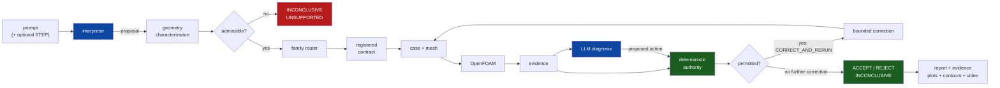

# CFD Forge

CFD Forge is a physics-constrained agentic framework built around OpenFOAM that
carries an engineering request through case construction, meshing, solver
execution, diagnostics and reporting. A large language model interprets the
request, assesses flow behaviour from simulation evidence, identifies likely
causes of problems and proposes corrective actions from a closed, family-specific
set. Acceptance is not left to the model: deterministic, family-specific
validators measure the registered criteria and decide whether a proposed action
may run and whether a result is accepted. The repository contains two registered
families, a converging-diverging nozzle and a two-dimensional forward-facing
step, the archived evidence of the agent sessions reported in the paper, a
turbulent-cube diagnostic study, and the controller comparison.

---

## Paper

**CFD Forge: A Physics-Constrained Agentic Framework for Autonomous CFD**
Aakash Shailesh Oza, Ryan F. Johnson, Amir Barati Farimani
Department of Mechanical Engineering, Carnegie Mellon University

- Preprint: arXiv (link to be added).
- Code: <https://github.com/aakashoza31/physics-constrained-cfd-agent>
- Manuscript source, figure data and figure scripts:
  [`paper/cfd_forge/`](paper/cfd_forge/)
- Session archive (agent session records, case files, solver logs, evidence
  packets): Zenodo (https://doi.org/10.5281/zenodo.23148676).

## Architecture



Blue: a language model contributes. Green: deterministic code decides. The
deterministic layer returns one of four decisions: `ACCEPT`,
`CORRECT_AND_RERUN` (not terminal: an approved corrective action is executed
and the result is reassessed), `REJECT`, or `INCONCLUSIVE` (a criterion the
request depends on is not registered, a needed action was refused, or the
evidence is insufficient). Details in [`docs/architecture.md`](docs/architecture.md)
and [`docs/scientific_authority.md`](docs/scientific_authority.md).

## What the system does

- Interprets a natural-language engineering request into a structured case
  specification.
- Routes the request to a registered family and checks it against the family's
  scope gate.
- Builds the case and mesh under that family's scientific contract.
- Executes OpenFOAM Foundation v14.
- Extracts evidence, asks the model to diagnose it, and lets the model propose
  one action from the family's closed vocabulary; a deterministic action
  validator rules on the proposal.
- Computes the verdict from the deterministic checks alone.
- Writes the report, evidence, diagnostics, plots, contours, field-evolution
  video and provenance of each run.

## What it does not claim

1. That arbitrary engineering prompts can be simulated. Two families are
   registered: the nozzle and the 2-D forward-facing step, both inviscid.
2. That arbitrary CAD can be meshed or solved. **No family accepts STEP.**
3. That the turbulent cube is a validated benchmark. It is a diagnostic study
   run outside the agent loop, not a family, and not a validated benchmark claim.
4. That registered acceptance is physical validation. Accepted runs pass their
   family's registered checks on a single mesh.
5. That model reasoning improves acceptance decisions over a fixed rule. In the
   controller comparison the fixed rule reached the same verdicts as CFD Forge.

Full accounting: [`docs/limitations.md`](docs/limitations.md).

## Registered families and studies

| Family | Configuration | Role in the paper |
|---|---|---|
| `nozzle` | converging-diverging nozzle, axisymmetric 5° wedge, 2,112 cells, inviscid compressible (`shockFluid`), 20 registered checks | registered family; agent runs |
| `forward_step_2d` | 2-D forward-facing step, Mach 2 canonical, Δx = Δy = 0.0125 (16,128 cells for h = 0.2, x = 0.6), transient, storage-aware mass closure | registered family; agent runs |
| `cube` | surface-mounted cube, 3-D URANS k-ω SST (`incompressibleFluid`) | diagnostic study run outside the agent loop; its stationarity gate (`cube-stationarity/1.0.0`) was registered retrospectively; not a family |

The cube calculation completed and its mean drag settled (drift 0.075%), but the
lateral-force half-window growth ratio is 2.10 against the registered limit of
1.25, so the retrospective gate returns `STILL_DEVELOPING` and the result is
`REJECT`. There is no turbulent validation claim.

The NACA0012 airfoil mesh study (`CFD_NOT_RUN`), the backward-facing step, the
3-D forward step and the CAD→Gmsh prototype stack are present in the repository
but are not part of the paper (see [Repository layout](#repository-layout)).

## Results

Outcomes of the archived agent sessions, as in the paper's session ledger
(`paper/cfd_forge/data/session_ledger.json`). The archived family status is
computed by the scientific validator; the decision follows the definitions above.

| Family | Request | Case directory | Archived status | Decision |
|---|---|---|---|---|
| nozzle | reference, p0 = 200 kPa (canonical run) | `cases/nozzle/canonical_reference` | `PASS_SINGLE_MESH` | `ACCEPT` |
| nozzle | exit radius 37 mm | `cases/nozzle/geometry_variation` | `PASS_SINGLE_MESH` | `ACCEPT` |
| nozzle | p0 = 220 kPa | `cases/nozzle/condition_variation` | `PASS_SINGLE_MESH` | `ACCEPT` |
| step (S2) | Mach 2, h = 0.2 | `cases/forward_step/mach20_canonical` | `PASS_2D_FORWARD_STEP` | `ACCEPT` |
| step (S3) | Mach 3.5, h = 0.2 | `cases/forward_step/mach35_variation` | `PASS_2D_FORWARD_STEP` | `ACCEPT` |
| step (S4) | Mach 3, h = 0.1 | `cases/forward_step/step_height_010` | `PASS_2D_FORWARD_STEP` | `ACCEPT` |
| step (S6) | Mach 3, h = 0.3, x = 1.0 | `cases/forward_step/step_height_030_x100` | `PASS_2D_FORWARD_STEP` | `ACCEPT` |
| step (S7) | Mach 3, h = 0.2, staged horizon | `cases/forward_step/iterative_correction` | `PASS_2D_FORWARD_STEP` | `ACCEPT` after supervised resumption and a restart-seam mass-closure fix |
| step (S5) | Mach 3, h = 0.3, x = 0.6 | `cases/forward_step/step_height_030_x060` | `FAIL` (no measurable compression front) | `REJECT` |
| step (S8) | Mach 3, h = 0.2, mesh-sensitivity request | `cases/forward_step/mesh_sensitivity` | `STOPPED_ACTION_REFUSED` (`REFINE_MESH` approved; `ACCEPT` refused, no registered cross-grid tolerance) | `INCONCLUSIVE` |
| step (S1) | Mach 2.5, h = 0.15 | `cases/forward_step/live_run` | `FAIL` from a false-positive fatal-error check | archived `REJECT`; `PASS_2D_FORWARD_STEP` on corrected deterministic reanalysis |

The three nozzle requests were accepted; they were repeated in further sessions
while the feedback loop was developed, including a separate continuation run
(1 ms `FAIL` → `CONTINUE_RUN`, `CONTINUE_RUN` → `ACCEPT` at 6 ms). All archived
sessions are development cases, not a held-out evaluation. Details:
[`docs/results.md`](docs/results.md) and [`docs/CASES.md`](docs/CASES.md).

Replaying the registered cases with `scripts/run_demo.py --mode replay`
reproduces their archived deterministic outcomes without running a solver. This
is a replay-consistency check, not an evaluation of the model. The replay trace
reports terminal verdicts (ACCEPT, REJECT, INCONCLUSIVE) and maps the
refused-action outcome of the mesh-sensitivity case (S8) to `INCONCLUSIVE`, as in
the paper.

## Controller comparison

The paper compares four controllers on archived decision points, using the same
model (`gemini-3.5-flash-lite`, temperature 0) and the current validators:

- **A, fixed rule**: the failed checks map to an action; no model call.
- **B, CFD Forge**: the model diagnoses the full evidence packet, including the
  deterministic check results; the action gate screens the proposal and the
  validator decides.
- **B', gates off**: the same model proposal is taken directly as the verdict.
- **C, model only**: the model returns a verdict from a filtered packet with the
  deterministic check outcomes removed.

Entries are correct decisions / decisions, with false accepts in parentheses:

| Controller | Archived (16 points) | Planted faults (18) | Defects (2) |
|---|---|---|---|
| A: fixed rule | 16/16 (0) | 18/18 (0) | 0/2 (0) |
| B: CFD Forge | 79/79 (0) | 53/53 (0) | 0/10 (0) |
| B': gates off | 74/79 (0) | 53/53 (0) | 0/10 (0) |
| C: model only | 72/79 (7) | 3/53 (50) | 5/10 (0) |

288 model calls were attempted and 284 succeeded (4 failed with
`429 RESOURCE_EXHAUSTED` and are excluded); 1,099,390 tokens; median latency
1.27 s per call.

- Script: [`paper/cfd_forge/scripts/controller_comparison.py`](paper/cfd_forge/scripts/controller_comparison.py)
  (contains the prompts and the list of blinded keys).
- Evidence: [`evidence/controller_comparison/20261001T213031Z/`](evidence/controller_comparison/20261001T213031Z/)
  (`summary.md`, `summary.json`, `records.jsonl`, `calls.jsonl`).

Rerunning it needs the archived agent sessions from the Zenodo session archive,
passed with `--demo-root`, and a `GEMINI_API_KEY`:

```bash
export GEMINI_API_KEY=...            # PowerShell: $env:GEMINI_API_KEY="..."
export GEMINI_MODEL=gemini-3.5-flash-lite
python paper/cfd_forge/scripts/controller_comparison.py \
    --demo-root <session-archive>/demo --repeats 5 --fault-repeats 3
```

`--dry-run` exercises the pipeline without API calls (arm B uses the recipe
proposal and arm C a stub). A rerun writes a new timestamped directory under
`evidence/controller_comparison/`. Model outputs are not reproducible exactly:
temperature 0 does not make the provider deterministic, so a rerun can differ
from the archived records.

The older four-arm harness `scripts/run_evaluation.py` is a separate legacy
replay harness and is not the paper's comparison; see
[`evaluation/README.md`](evaluation/README.md).

## Quickstart

```bash
git clone https://github.com/aakashoza31/physics-constrained-cfd-agent
cd physics-constrained-cfd-agent
python -m pip install -r requirements.txt

python scripts/run_demo.py --list
python scripts/run_demo.py --family nozzle --case canonical_reference --mode replay
```

The last command needs no solver and no API key. It re-derives the deterministic
decision of the canonical nozzle run from its archived evidence.

## Reproducing the paper

### Figures (no key, no solver)

```bash
python paper/cfd_forge/scripts/make_figures.py            # fig2_configurations, fig3_nozzle, fig4_step, fig5_cube
python paper/cfd_forge/scripts/make_mesh_field_figures.py # fig_mesh_nozzle, fig_mesh_step_cube, fig_nozzle_fields,
                                                          # fig_step_evolution, fig_cube_wake, fig_agent_stats
python paper/cfd_forge/scripts/make_agent_loop_figure.py  # fig_agent_loop
```

The scripts read archived data from `paper/cfd_forge/data/` (inventory and
SHA-256 digests in `paper/cfd_forge/data/DATA_MANIFEST.json`) and write PDF and
PNG files to `paper/cfd_forge/figures/`. `fig1_workflow` is not generated by a
script, and `fig2_configurations` is not used in the final manuscript.

### Replay (no key, no solver)

```bash
python scripts/run_demo.py --family nozzle       --case canonical_reference  --mode replay
python scripts/run_demo.py --family forward_step --case mach20_canonical     --mode replay
python scripts/run_demo.py --family forward_step --case step_height_030_x060 --mode replay
python scripts/run_demo.py --family forward_step --case mesh_sensitivity     --mode replay
python scripts/run_demo.py --family cube         --case drifting_wake        --mode replay
```

Each run writes `runs/<timestamp>_<family>_<case>/` with `report/`, `evidence/`,
`diagnostics/`, `plots/`, `contours/`, `video/`, `provenance.json` and
`final_decision.json`; every artifact carries `solver_invoked: false`.
Pre-generated copies for representative cases are committed under `evidence/`.

### Agent runs (key and solver required)

The paper's agent sessions were run with the family runners:

```bash
export GEMINI_API_KEY=...
export GEMINI_MODEL=gemini-3.5-flash-lite   # the default; set explicitly for clarity

# nozzle: reference request, and the continuation loop from an incomplete 1 ms window
python scripts/run_nozzle_e2e.py --case A
python scripts/run_nozzle_feedback.py --case A --feedback-demo

# forward-facing step: Mach-2 canonical request
python scripts/run_forward_step_2d.py --request-file examples/forward_step_2d/CASE_B_MACH20.txt
```

Request texts for the other cases are in `examples/nozzle_e2e/` and
`examples/forward_step_2d/`. These runners need OpenFOAM Foundation v14 (the
paper used build `14-7b05503f98a8` under WSL 2; see `.env.example` for
`OPENFOAM_WSL_DISTRO` and `OPENFOAM_BASHRC`). The historical sessions ran from
development trees, so a rerun reproduces the workflow and the artifacts, not the
exact model outputs.

### Demo backend of `run_demo.py` / `run_agent.py`

```bash
--agent-backend deterministic   # default. No API key. NOT an LLM run.
--agent-backend gemini          # a real model call; needs GEMINI_API_KEY
--agent-backend replay          # demo mode; behaves like deterministic (recorded responses are not replayed)
```

The deterministic backend of `scripts/run_demo.py` and `scripts/run_agent.py` is a
no-key demo mode (keyword and recipe logic); it is not the configuration used for
the paper's agent runs. Without a key the `gemini` backend refuses rather than
falling back, so a deterministic run is never described as an LLM run. Each model
call records provider, model, temperature, prompt-schema version, the raw
response, the proposed action and whether authority accepted it. Token counts:
the `gemini` backend of `run_demo.py`/`run_agent.py` records them when the
provider returns usage metadata; the call records of the family runners do not,
so token usage was not logged for the archived nozzle and step sessions. Tokens
were recorded for the cube diagnosis and the controller comparison.

## Live vs replay

| Mode | Solver | Reads archive | Needs OpenFOAM | Use |
|---|---|---|---|---|
| `--mode dry-run` | no | no | no | check routing and the contract |
| `--mode replay` | no | yes | no | re-derive a registered case's decision |
| `--mode live` | yes | no | **v14** | execute a new run |

Live execution additionally requires `--i-want-to-run-cfd`.

## Natural-language and STEP interface

```bash
python scripts/run_agent.py --prompt "Simulate a supersonic converging-diverging \
    nozzle with throat radius 0.01 m" --mode dry-run

python scripts/run_agent.py --prompt "analyse this part" --geometry part.step
```

The second returns **INCONCLUSIVE / UNSUPPORTED** without meshing anything. The
STEP header and entity histogram are read; no bounding box or characteristic
dimension is invented; no family declares `step: true`.
See [`docs/cad_and_step_input.md`](docs/cad_and_step_input.md).

## Adding a family

See [`docs/adding_a_family.md`](docs/adding_a_family.md) and
[`docs/family_protocol.md`](docs/family_protocol.md).

## Repository layout

```
src/agents/         model stages: request interpretation, mesh review, diagnosis,
                    field observation, reporting; call provenance
src/reasoning/      evidence packets, scope gates, action vocabularies and validators
src/contracts/      typed records: problem spec, CFD evidence, agent decision
src/orchestrator/   decision loop (decide_once / run_loop), modes, ledger
src/eval/           evidence-level evaluation harness and fault injection
src/router/         family routing
src/pipeline/       per-family build / execute / diagnose / validate
src/families/       family adapters, capability declarations, cube stationarity gate
src/authority/      agent/authority boundary and terminal replay trace
src/agent/, src/orchestration/, src/reporting/
                    run_demo / run_agent pipeline, replay, reports and media
paper/cfd_forge/    manuscript, figure data, figure and analysis scripts
evidence/           pre-generated artifact directories, cube LLM diagnosis,
                    controller comparison
cases/              registered cases: case.yaml, expected_result.json, reproduce.*
scripts/            family runners, demo and replay CLIs
docs/               documentation
tests/              test suite
```

Present but not part of the paper: the 3-D forward step
(`src/pipeline/forward_step/`, `scripts/run_forward_step.py`,
[`docs/forward_step_3d.md`](docs/forward_step_3d.md)), the NACA0012 airfoil mesh
study (`src/pipeline/airfoil/`, `cases/airfoil/mesh_rejection`, `CFD_NOT_RUN`),
the backward-facing step (`src/families/backward_step/`, not implemented as a
runnable family) and the CAD→Gmsh prototype stack (`src/cad/`, `src/meshing/`,
`src/openfoam/`).

## Limitations

Two registered families, both inviscid; accepted runs are single-mesh
verifications with no grid-convergence index and no uncertainty quantification.
The cube is a diagnostic study with a retrospectively registered gate. All
archived agent sessions are development cases. Model outputs are not repeatable
at temperature 0. No STEP support. Live results are claimed only for OpenFOAM
Foundation v14. Read [`docs/limitations.md`](docs/limitations.md) before citing
anything.

## Citation

```bibtex
@misc{oza2026cfdforge,
  title         = {{CFD Forge}: A Physics-Constrained Agentic Framework for
                   Autonomous {CFD}},
  author        = {Oza, Aakash Shailesh and Johnson, Ryan F. and
                   Barati Farimani, Amir},
  year          = {2026},
  eprint        = {TBD},
  archivePrefix = {arXiv},
  note          = {Preprint; arXiv identifier to be added}
}
```

Citation metadata: [`CITATION.cff`](CITATION.cff). License: MIT
([`LICENSE`](LICENSE)).
