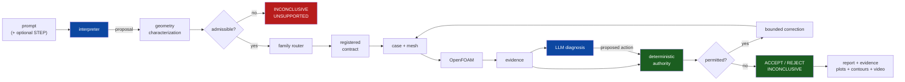

# Physics-Constrained Autonomous CFD Agent

A CFD agent in which a language model interprets engineering requests, routes
them, diagnoses simulation evidence and proposes corrective actions — and in
which **no model output can accept a result**. Every scientific decision is made
by deterministic code that the model cannot reach: geometry admissibility, mesh
quality, numerical health, conservation, convergence, stationarity, validation,
permitted actions and the final verdict. The contribution is not a faster solver.
It is an architecture in which an autonomous agent cannot produce a confident
false acceptance, demonstrated by the cases where it refuses: a three-dimensional
turbulent run that executed cleanly and was rejected because a lateral flow mode
was still growing, and a fourth family whose every candidate mesh was refused so
that no CFD was ever run.

---

## 1. Architecture



Blue: a language model contributes. Green: deterministic code decides. Details in
[`docs/architecture.md`](docs/architecture.md) and
[`docs/scientific_authority.md`](docs/scientific_authority.md).

## 2. What the system does

- Interprets a natural-language engineering request into a structured problem
  statement.
- Characterises the geometry (parametric today; STEP is classified and refused).
- Routes to a registered family, and **checks** the route rather than trusting it.
- Builds the case and mesh under that family's frozen scientific contract.
- Executes OpenFOAM Foundation v14.
- Extracts evidence, asks a model to diagnose it, and lets the model propose one
  of a closed set of corrective actions.
- Runs every deterministic gate and computes the verdict from the gates alone.
- Emits a complete artifact directory: report, evidence, diagnostics, plots,
  contours, video and provenance.

## 3. What it deliberately does **not** claim

1. That arbitrary engineering prompts can be simulated. Two families are
   validated, both inviscid compressible Euler, both 2-D.
2. That arbitrary CAD can be meshed or solved. **No family accepts STEP.**
3. That the cube case is a validated simulation of flow over a cube. It was
   executed and **rejected**.
4. That the NACA0012 work reproduces NASA results. **No CFD was run** for it.
5. That LLM diagnosis improves accuracy. The claim is narrower: it cannot
   compromise it, because it cannot overrule the gates.

Full accounting: [`docs/limitations.md`](docs/limitations.md).

## 4. Three headline cases

| | Family | Case | Outcome | Why it is here |
|---|---|---|---|---|
| **F1** | `nozzle` | `canonical_reference` (+2) | **ACCEPTED** | validated acceptance, continuation and correction |
| **F2** | `forward_step_2d` | `mach20_canonical` (+7) | **ACCEPTED** (5) / **safe stop** (3) | variations, mesh sensitivity, and an inadmissible variation refused |
| **F3** | `cube` | `drifting_wake` | **RUNTIME REJECTED** | 3-D turbulent execution refused on flow development |
| S1 | `airfoil` | `mesh_rejection` | **MESH REJECTED, `CFD_NOT_RUN`** | supplementary: the mesh contract refusing three generations |

### The F3 refusal, in numbers

| Quantity | Measured | Limit | Result |
|---|---|---|---|
| Streamwise force drift over the final window | **0.08%** | ≤ 2% | PASS |
| Mean lateral force / mean drag | 6.3e-4 | ≤ 0.05 | PASS |
| **Lateral force growth across the window** | **2.10×** | **≤ 1.25×** | **FAIL** |

The lateral force is a periodic mode of period ≈ 10.1 time units whose amplitude
grew **68×** (1.01e-4 → 6.91e-3) at 0.091 per time unit, e-folding in 11.0, and
had not saturated when the run ended. Every conventional convergence indicator
passed; the drag was settled to 0.08%. A pipeline watching the drag would have
accepted a flow that was still developing.

## 5. Results and status

| Family | Status | Cases | Accepted | Rejected | Solver run |
|---|---|---|---|---|---|
| `nozzle` | ACCEPTED | 3 | 3 | 0 | yes |
| `forward_step_2d` | ACCEPTED | 8 | 5 | 3 | yes |
| `cube` | RUNTIME_REJECTED | 1 | 0 | 1 | yes |
| `airfoil` | SUPPLEMENTARY | 1 | 0 | 1 | **no** (`CFD_NOT_RUN`) |
| `backward_step` | NOT_IMPLEMENTED | 0 | — | — | no |

Replaying all 13 registered cases through the full agent gives a measured
**false-acceptance rate of 0.0** and a **correct-rejection rate of 1.0**. The
three ablation arms are `NOT_RUN`. Details: [`docs/results.md`](docs/results.md).

## 6. Quickstart

```bash
git clone <this repository> && cd physics-constrained-cfd-agent
python -m pip install -r requirements.txt

python scripts/run_demo.py --list
python scripts/run_demo.py --family cube --case drifting_wake --mode replay
```

The last command needs no solver and no API key. It re-runs the stationarity gate
over 2003 archived force samples and prints the rejection with its reasoning.

## 7. Live vs replay

| Mode | Solver | Reads archive | Needs OpenFOAM | Use |
|---|---|---|---|---|
| `--mode dry-run` | no | no | no | check routing and the contract |
| `--mode replay` | no | yes | no | reproduce any registered case |
| `--mode live` | yes | no | **v14** | execute a new run |

Live execution additionally requires `--i-want-to-run-cfd`. Replay never claims a
solver ran: every artifact it writes carries `solver_invoked: false`.

## 8. Natural-language and STEP interface

```bash
python scripts/run_agent.py --prompt "Simulate a supersonic converging-diverging \
    nozzle with throat radius 0.01 m" --mode dry-run

python scripts/run_agent.py --prompt "analyse this part" --geometry part.step
```

The second returns **INCONCLUSIVE / UNSUPPORTED** without meshing anything. The
STEP header and entity histogram are read; no bounding box or characteristic
dimension is invented; no family declares `step: true`.
See [`docs/cad_and_step_input.md`](docs/cad_and_step_input.md).

## 9. Reproduction commands

```bash
# every registered case, replayed
python scripts/run_demo.py --family nozzle       --case canonical_reference            --mode replay
python scripts/run_demo.py --family forward_step --case mach20_canonical               --mode replay
python scripts/run_demo.py --family forward_step --case step_height_030_short_horizon  --mode replay
python scripts/run_demo.py --family cube         --case drifting_wake                  --mode replay
python scripts/run_demo.py --family airfoil      --case mesh_rejection                 --mode replay

# or from the case directory
cd cases/cube/drifting_wake && ./reproduce.sh

# live (requires OpenFOAM Foundation v14)
python scripts/run_demo.py --family nozzle --case canonical_reference --mode live --i-want-to-run-cfd
```

Each run writes `runs/<timestamp>_<family>_<case>/` with `report/`, `evidence/`,
`diagnostics/`, `plots/`, `contours/`, `video/`, `provenance.json` and
`final_decision.json`. Pre-generated copies for the headline cases are committed
under `evidence/`.

## 10. Evaluation

```bash
python scripts/run_evaluation.py --arm full_agent --mode replay
python scripts/run_evaluation.py --summarise
```

Arms: full agent, fixed recipe + fixed rules, agent without deterministic gates,
gates without diagnosis. Only the first has been run; the others print `NOT_RUN`
rather than a fabricated zero. See [`evaluation/README.md`](evaluation/README.md).

## 11. Adding a family

Five files and a case directory; no change to `src/agent/` or `src/authority/`.
See [`docs/adding_a_family.md`](docs/adding_a_family.md).

## 12. Repository layout

```
src/agent/          request interpretation and the pipeline
src/authority/      the agent/authority boundary, gates, verdicts
src/geometry/       STEP reading, features, family matching, admissibility
src/families/       capability declarations, recipes, adapters, per-family gates
src/pipeline/       per-family build / execute / diagnose / validate
src/orchestration/  replay and live execution
src/reporting/      report builder, plots, ParaView contours, video
src/evaluation/     ablation metrics
cases/              registered cases: case.yaml, expected_result.json, reproduce.*
evidence/           pre-generated artifact directories for the headline cases
demo/, handoff/     archived campaign evidence
docs/, paper/       documentation and the manuscript outline
tests/              the test suite
```

## 13. Scientific limitations

Two validated families, both inviscid and 2-D. No turbulent validation: the one
turbulent family that executed was rejected. No STEP support. No quantified
grid-convergence index, no uncertainty quantification. Live results are claimed
only for OpenFOAM Foundation v14. Read
[`docs/limitations.md`](docs/limitations.md) before citing anything.

## 14. Citation

```bibtex
@misc{physics_constrained_cfd_agent,
  title  = {A Physics-Constrained Autonomous CFD Agent with Deterministic
            Scientific Authority},
  author = {Oza, Aakash},
  year   = {2026},
  note   = {Research artifact; manuscript in preparation.
            See docs/paper_overview.md and paper/manuscript_outline.md}
}
```
