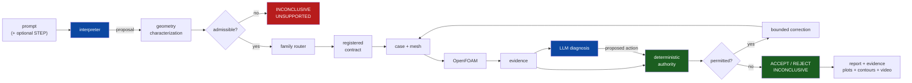

# Physics-Constrained Autonomous CFD Agent

A CFD agent in which a language model interprets engineering requests, routes
them to registered simulation families, diagnoses simulation evidence and
proposes bounded corrective actions. Scientific acceptance remains deterministic:
geometry admissibility, mesh quality, numerical health, conservation, convergence,
stationarity and validation are evaluated by code outside the language model.
The current research artifact demonstrates end-to-end autonomous CFD workflows
for two validated compressible-flow families, with reproducible case generation,
OpenFOAM execution, diagnostics, reporting and provenance. Supplementary studies
exercise how the framework handles cases that are not yet certified for a
validated scientific claim.

---

## 1. Architecture



Blue: a language model contributes. Green: deterministic code decides. Details in
[`docs/architecture.md`](docs/architecture.md) and
[`docs/scientific_authority.md`](docs/scientific_authority.md).

## 2. What the system does

- Interprets a natural-language engineering request into a structured problem
  statement.
- Characterises the geometry (parametric today; STEP is classified and refused).
- Routes to a registered family, and **checks** the route rather than trusting it.
- Builds the case and mesh under that family's frozen scientific contract.
- Executes OpenFOAM Foundation v14.
- Extracts evidence, asks a model to diagnose it, and lets the model propose one
  of a closed set of corrective actions.
- Runs every deterministic gate and computes the verdict from the gates alone.
- Emits a complete artifact directory: report, evidence, diagnostics, plots,
  contours, video and provenance.

## 3. What it deliberately does **not** claim

1. That arbitrary engineering prompts can be simulated. Two families are
   validated, both inviscid compressible Euler, both 2-D.
2. That arbitrary CAD can be meshed or solved. **No family accepts STEP.**
3. That the exploratory cube study is a validated turbulent benchmark. It is
   retained as a supplementary stationarity/development study and is **not part
   of the validated headline claims**.
4. That the NACA0012 work reproduces NASA results. **No CFD was run** for it,
   and its rejection rests on in-plane stretching alone — Foundation-v14
   skewness passes on all three levels, and the orientation and in-plane defects
   in the first diagnosis were **ours**, not the grid's.
5. That LLM diagnosis improves accuracy. The claim is narrower: it cannot
   compromise it, because it cannot overrule the gates.

Full accounting: [`docs/limitations.md`](docs/limitations.md).

## 4. Validated families and supplementary studies

The current validated headline results are the nozzle and two-dimensional
forward-facing-step families. The cube and airfoil records are retained as
supplementary development studies rather than presented as validated families.

| | Family | Case | Scientific role |
|---|---|---|---|
| **F1** | `nozzle` | `canonical_reference` (+2) | **VALIDATED**: accepted reference, continuation and controlled variation |
| **F2** | `forward_step_2d` | `mach20_canonical` (+7) | **VALIDATED**: accepted canonical/variation cases plus bounded safe-stop cases |
| X1 | `cube` | `drifting_wake` | **EXPERIMENTAL**: 3-D turbulent stationarity/development study; not a validated benchmark claim |
| S1 | `airfoil` | `mesh_rejection` | **SUPPLEMENTARY**: mesh-development record; CFD was not run |

The cube study is intentionally excluded from the validated-family count. Its
archived machine-readable decision and force-history evidence are preserved for
provenance, but the advisor-facing research claim is simply that turbulent cube
validation remains future work.

## 5. Results and status

| Family | Role | Registered cases | Current validated claim | Solver run |
|---|---|---:|---|---|
| `nozzle` | VALIDATED | 3 | 3 accepted reference/variation cases | yes |
| `forward_step_2d` | VALIDATED | 8 | 5 accepted cases; 3 bounded safe-stop cases | yes |
| `cube` | EXPERIMENTAL | 1 | no turbulent validation claim | yes |
| `airfoil` | SUPPLEMENTARY | 1 | mesh-development only; `CFD_NOT_RUN` | no |
| `backward_step` | NOT_IMPLEMENTED | 0 | none | no |

Replaying all 13 registered records reproduces their archived deterministic
outcomes. This is a **registered-case safety regression / replay-consistency
test**, not the paper's model-generalisation evaluation. The ablation study is
`NOT_RUN`. Details: [`docs/results.md`](docs/results.md).

## 6. Quickstart

```bash
git clone <this repository> && cd physics-constrained-cfd-agent
python -m pip install -r requirements.txt

python scripts/run_demo.py --list
python scripts/run_demo.py --family nozzle --case canonical_reference --mode replay
```

The last command needs no solver and no API key. It reproduces the archived
canonical-nozzle evidence and deterministic decision path.

## 7. Live vs replay

| Mode | Solver | Reads archive | Needs OpenFOAM | Use |
|---|---|---|---|---|
| `--mode dry-run` | no | no | no | check routing and the contract |
| `--mode replay` | no | yes | no | reproduce any registered case |
| `--mode live` | yes | no | **v14** | execute a new run |

Live execution additionally requires `--i-want-to-run-cfd`. Replay never claims a
solver ran: every artifact it writes carries `solver_invoked: false`.

## 7a. Agent backends

```bash
--agent-backend deterministic   # default. No API key. NOT an LLM run.
--agent-backend gemini          # a real model call; needs GEMINI_API_KEY
--agent-backend replay          # a recorded model response
```

The model interprets the request and diagnoses the evidence. Its proposed action
must be in the family's registered vocabulary or it is refused, and it can never
reach the verdict. Every call records provider, model, temperature,
prompt-schema version, the raw response, the proposed action, whether authority
accepted it, and token counts where the provider reports them. Without a key the
`gemini` backend **refuses** rather than quietly falling back — a deterministic
run is never described as an LLM run.

## 8. Natural-language and STEP interface

```bash
python scripts/run_agent.py --prompt "Simulate a supersonic converging-diverging \
    nozzle with throat radius 0.01 m" --mode dry-run

python scripts/run_agent.py --prompt "analyse this part" --geometry part.step
```

The second returns **INCONCLUSIVE / UNSUPPORTED** without meshing anything. The
STEP header and entity histogram are read; no bounding box or characteristic
dimension is invented; no family declares `step: true`.
See [`docs/cad_and_step_input.md`](docs/cad_and_step_input.md).

## 9. Reproduction commands

```bash
# every registered case, replayed
python scripts/run_demo.py --family nozzle       --case canonical_reference            --mode replay
python scripts/run_demo.py --family forward_step --case mach20_canonical               --mode replay
python scripts/run_demo.py --family forward_step --case step_height_030_short_horizon  --mode replay
python scripts/run_demo.py --family airfoil      --case mesh_rejection                 --mode replay

# live (requires OpenFOAM Foundation v14)
python scripts/run_demo.py --family nozzle --case canonical_reference --mode live --i-want-to-run-cfd
```

Each run writes `runs/<timestamp>_<family>_<case>/` with `report/`, `evidence/`,
`diagnostics/`, `plots/`, `contours/`, `video/`, `provenance.json` and
`final_decision.json`. Pre-generated copies for representative validated and supplementary cases are committed
under `evidence/`.

## 10. Evaluation

```bash
python scripts/run_evaluation.py --arm full_agent --mode replay
python scripts/run_evaluation.py --summarise
```

Arms: full agent, fixed recipe + fixed rules, agent without deterministic gates,
gates without diagnosis. Only the first has been run; the others print `NOT_RUN`
rather than a fabricated zero. See [`evaluation/README.md`](evaluation/README.md).

## 11. Adding a family

Five files and a case directory; no change to `src/agent/` or `src/authority/`.
See [`docs/adding_a_family.md`](docs/adding_a_family.md).

## 12. Repository layout

```
src/agent/          request interpretation and the pipeline
src/authority/      the agent/authority boundary, gates, verdicts
src/geometry/       STEP reading, features, family matching, admissibility
src/families/       capability declarations, recipes, adapters, per-family gates
src/pipeline/       per-family build / execute / diagnose / validate
src/orchestration/  replay and live execution
src/reporting/      report builder, plots, ParaView contours, video
src/evaluation/     ablation metrics
cases/              registered cases: case.yaml, expected_result.json, reproduce.*
evidence/           pre-generated artifact directories for the headline cases
demo/, handoff/     archived campaign evidence
docs/, paper/       documentation and the manuscript outline
tests/              the test suite
```

## 13. Scientific limitations

Two validated families, both inviscid and 2-D. Turbulent validation is still
future work; the cube study is retained only as an exploratory stationarity and
development record. No STEP support. No quantified grid-convergence index and no
uncertainty quantification. Live results are claimed only for OpenFOAM Foundation
v14. Read
[`docs/limitations.md`](docs/limitations.md) before citing anything.

## 14. Citation

```bibtex
@misc{physics_constrained_cfd_agent,
  title  = {A Physics-Constrained Autonomous CFD Agent with Deterministic
            Scientific Authority},
  author = {Oza, Aakash},
  year   = {2026},
  note   = {Research artifact; manuscript in preparation.
            See docs/paper_overview.md and paper/manuscript_outline.md}
}
```
