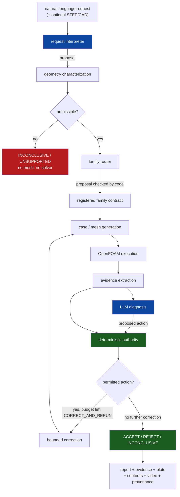

# Architecture

This page is the map. `docs/architecture_detail.md` details the nozzle family's
agent loop and lists both families' action vocabularies.

Blue stages are where a language model contributes. Green stages are decided by
deterministic code. Nothing crosses that colour boundary.

The deterministic layer returns one of four decisions: `ACCEPT`,
`CORRECT_AND_RERUN` (not terminal: an approved corrective action is executed and
the result is reassessed), `REJECT` and `INCONCLUSIVE`. See
`docs/scientific_authority.md`.

## Layers

| Layer | Package | Responsibility |
|---|---|---|
| Model stages | `src/agents/`, `src/reasoning/` | request interpretation, mesh review, diagnosis, field observation, reporting; evidence packets, scope gates, action vocabularies and action validators |
| Contracts | `src/contracts/` | typed problem spec, CFD evidence and agent decision |
| Orchestrator | `src/orchestrator/` | `decide_once` / `run_loop`, the four decisions, modes, ledger |
| Router | `src/router/` | family routing |
| Agent CLI | `src/agent/` | `run_demo.py` / `run_agent.py` pipeline: interpret, route, record proposals |
| Geometry | `src/geometry/` | STEP reading, feature extraction, family matching, admissibility |
| Authority | `src/authority/` | the gate/proposal boundary and the terminal replay/dry-run trace |
| Families | `src/families/` | capability declarations, recipes, adapters, per-family gates |
| Pipelines | `src/pipeline/` | per-family build / execute / diagnose / validate |
| Orchestration | `src/orchestration/` | replay of archived evidence, live execution handoff |
| Reporting | `src/reporting/` | the standard artifact directory, plots, contours, video |
| Evaluation | `src/eval/`, `src/evaluation/`, `evaluation/` | evidence-level harness and fault injection (used by the controller comparison, `paper/cfd_forge/scripts/controller_comparison.py`); legacy replay harness metrics |

## The family protocol in one line

A family is admissible for a request when it is registered, routable, accepts the
geometry source, and the geometry normalised by its characteristic dimension
lies in its registered envelope. See `docs/family_protocol.md`.

## Execution modes

| Mode | Touches a solver | Reads archived evidence | Typical use |
|---|---|---|---|
| `dry-run` | no | no | check routing and the contract |
| `replay` | no | yes | re-derive a registered case's decision |
| `live` | yes, with opt-in | no | execute a new run |

Replay re-evaluates the deterministic gates against archived evidence rather than
reprinting a stored verdict, so a replay that disagrees with `expected_result.json`
is a regression the test suite catches.

The paper's agent runs used the family runners (`scripts/run_nozzle_e2e.py`,
`scripts/run_nozzle_feedback.py`, `scripts/run_forward_step_2d.py`) with a
Gemini model. The default deterministic backend of `scripts/run_demo.py` and
`scripts/run_agent.py` is a no-key demo mode, not the paper's configuration.
