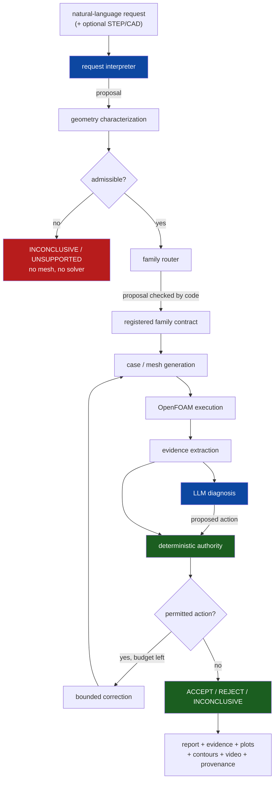

# Architecture

This page is the map. `docs/architecture_detail.md` is the original, longer
narrative of the same design and is preserved unchanged.

Blue stages are where a language model contributes. Green stages are decided by
deterministic code. Nothing crosses that colour boundary.

## Layers

| Layer | Package | Responsibility |
|---|---|---|
| Agent | `src/agent/` | interpret the request, run the pipeline, record proposals |
| Geometry | `src/geometry/` | STEP reading, feature extraction, family matching, admissibility |
| Authority | `src/authority/` | the gate/proposal boundary, the authority trace, the verdict |
| Families | `src/families/` | capability declarations, recipes, adapters, per-family gates |
| Pipelines | `src/pipeline/` | per-family build / execute / diagnose / validate |
| Orchestration | `src/orchestration/` | replay of archived evidence, live execution handoff |
| Reporting | `src/reporting/` | the standard artifact directory, plots, contours, video |
| Evaluation | `src/evaluation/`, `evaluation/` | ablation harness and metrics |

## The family protocol in one line

A family is admissible for a request when it is registered, routable, accepts the
geometry source, and the geometry normalised by its characteristic dimension
lies in its registered envelope. See `docs/family_protocol.md`.

## Execution modes

| Mode | Touches a solver | Reads archived evidence | Typical use |
|---|---|---|---|
| `dry-run` | no | no | check routing and the contract |
| `replay` | no | yes | reproduce a registered case |
| `live` | yes, with opt-in | no | execute a new run |

Replay re-evaluates the deterministic gates against archived evidence rather than
reprinting a stored verdict, so a replay that disagrees with `expected_result.json`
is a regression the test suite catches.
